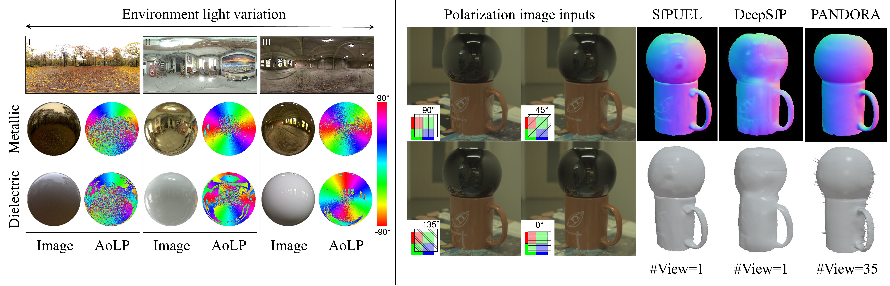

# SfPUEL
SfPUEL: Shape from Polarization under Unknown Environment Light, NeurIPS 2024
                                                                 
>[Youwei Lyu](https://youweilyu.github.io/)<sup>1</sup>, [Heng Guo](https://gh-home.github.io/)<sup>1</sup>, Kailong Zhang<sup>1</sup>, [Si Li](https://teacher.bupt.edu.cn/lisi/en/index.htm)<sup>1</sup>, and [Boxin Shi](https://camera.pku.edu.cn/team)<sup>2</sup>  
<sup>1</sup>Beijing University of Posts and Telecommunications, <sup>2</sup>Peking University

 This paper proposes a learning-based method to address the problem of shape from polarization (SfP) under unknown environment light.


## Dependencies
SfPUEL is implemented with PyTorch and tested on Ubuntu 22.04.
- Python 3.10
- cv2, tqdm, pandas, einops
- PyTorch 2.0.1+cu118

```bash
conda create -n sfpuel python=3.10 -y
conda activate sfpuel

pip install -r requirements.txt
pip install --no-cache-dir torch==2.0.1 torchvision torchaudio --index-url https://download.pytorch.org/whl/cu118
git clone https://github.com/YouweiLyu/SfPUEL.git
```

## Dataset Preparation
The real-world test dataset and synthetic test samples can be download from [GoogleDrive](https://drive.google.com/file/d/1iHEjg90X2bOSkdt9uBCEd76SqzHj5pPC/view?usp=drive_link).

The test data is structured as follows. You may arrange your dataset in the same format for test.
```
test_data_dir/
├── pol000/       # polarization images at 0 degree
├── pol045/       # polarization images at 45 degree
├── pol090/       # polarization images at 90 degree
├── pol135/       # polarization images at 135 degree
├── normal/       # ground-truth normal maps
├── mask/         # mask
```

## Usage

### Run inference for normal
First download the trained model from [GoogleDrive](https://drive.google.com/file/d/1auSwlzX5knJabxYe7cHYkUGR4BU4Zsdw/view?usp=drive_link) and unzip it in the root directory of this repository. The checkpoint is unzipped to `data/checkpoints/ckpt.pth`.

* Test SfPUEL without evaluation by running:
    ```shell
    test_data_dir="SfPUEL_test_data/real1"
    save_folder="sfpuel_real1"
    python tools/test.py --data_dir_tst $test_data_dir --suffix $save_folder
    ```
    The estimated normal maps are stored in `results/$save_folder`.

* Test SfPUEL and evaluate the normal predictions by running:
    ```shell
    test_data_dir="SfPUEL_test_data/real1"
    save_folder="sfpuel_real1"
    python tools/test.py --data_dir_tst $test_data_dir --suffix $save_folder &&\
        python tools/normal_criterion.py -d results/$save_folder --gt_data_dir $test_data_dir 

    ```
    The quantitative results can be found in `results/${save_folder}_normal_eval.xlsx`.
    
    Note: due to random sampling operations in the implementation, quantitative results might slightly vary with each run.

### Training
Cooming soon.

## Citation
If you find this code useful in your research, please consider cite: 
```bibtex
@inproceedings{lyu2024sfpuel,
    title={Sf{PUEL}: Shape from Polarization under Unknown Environment Light},
    author={Youwei Lyu and Heng Guo and Kailong Zhang and Si Li and Boxin Shi},
    booktitle={The Thirty-eighth Annual Conference on Neural Information Processing Systems (NeurIPS)},
    year={2024},
}
```